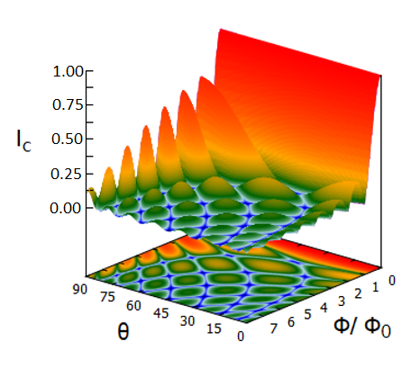

# JJSimulator

## Introduction

JJSimulator is a mathematical tool used to model the critical current through a Josephson Junction when a magnetic field is applied. A 3D model can be generated showing how the critical current varies with the direction and strength of the applied field. Changes to the junctions charge density distributions can be modelled enabling insight into certain junctions charge distributions.

The data generated is output in "tsv" or "csv" format for visualisation or further processing. A great webapp to use for visualising the output data is [plot3d](https://oomzay.github.io/plot3d/).



The mathematics is based on the theory presented by Antonio Barone and GianFranco Paterno in "Physics And Applications Of The Josephson Effect". 

## Installation

```
git clone ...
cd JJSimulator
cmake -S . -B build
cd build
make
```

## Usage

JJSimulator is run from the commandline and accepts a number of optional arguments. Output is written to stdout and can be redirected to a file. For example:

```
./JJSimulator --write_to csv >> 3d-model.csv
```

### Available Arguments

| Arguments      | Description |
| ----------- | ----------- |
| **--help**      |      shows options  |
| **--lowfield**  |      lowest field used (default 0)     |
| **--highfield**   |      highest field used (default 0.15)      |
| **--magres**   |      n points per angle (default 100)     |
| **--intres**   |      n trapezoid integral! (default 100)      |
| **--length**   |      length default (500E-9)     |
| **--width**   |     width default (500E-9)      |
| **--height**   |      height default (1E-9)      |
| **--angleincrement**   |     how much to inrement angle by 0-90 (default 1)     |
| **--step_height**   |      fraction of max critica current. (default 0.1)      |
| **--write_to**   |      csv or tsv      |
| **--distribution**   |      current density 1d or 2d     |
| **--view**   |      profile or critical_current     |
| **--step_thickness**   |      fraction of length.(default 0.1)      |

To view the current density distribution use view "profile". To view the critical current 3d plot view "critical_current".

## License

[MIT](LICENCE.md)

## Authors and acknowledgment

This project was a collaboration between Alistair Child and Shalaka Kulkarni under a project supervised by Niladri Banerjee. 
